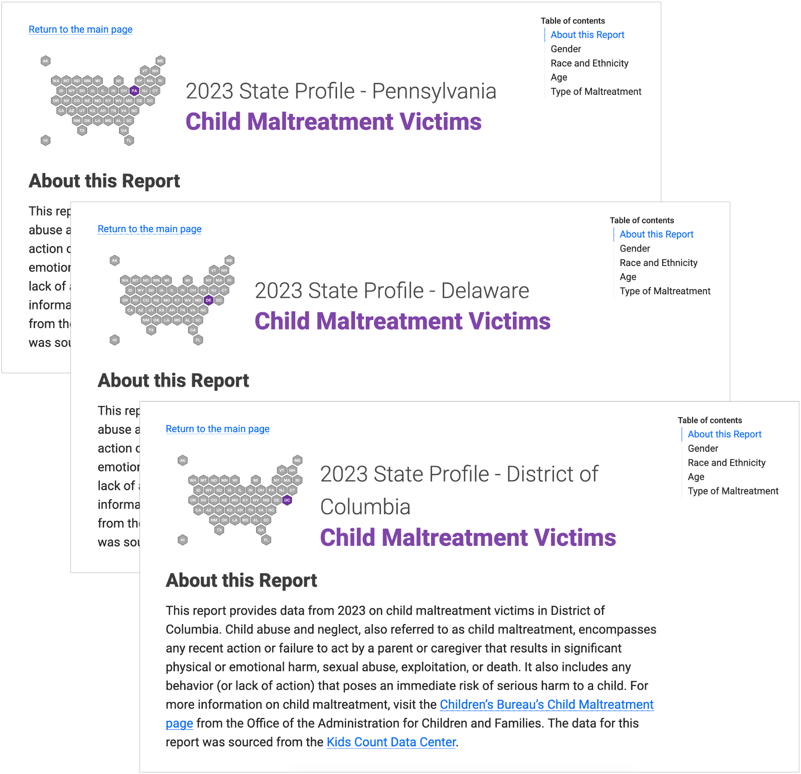

# State-Level Profiles - Child Maltreatment Victims

<div align='center'>
  
</div>

## About

This repository provides a streamlined workflow for generating a series of reports in a consistent style using Quarto (`.qmd`). Each report adheres to a unified template and structure, while presenting unique data and values. The reports are rendered to HTML and can be seamlessly deployed to GitHub Pages, featuring a main `index.html` as the landing page.

The template report compares 2023 state-level demographic data on child maltreatment victims by gender, race/ethnicity, age, and type of maltreatment.  

- For more information, see the [Children's Bureau Child Maltreatment page](https://www.acf.hhs.gov/cb/data-research/child-maltreatment).  
- Data for this report is from the [Kids Count Data Center](https://datacenter.kidscount.org/data).

**View the published template report:**  
[2023 report on GitHub Pages](https://anyamemensah.github.io/child-mal)

---

## How to use this repository

First, double click on the R project file (`chil-mal.Rproj`) to load the project. Next, open the R script `main.R`.

### Process the data

Process the data for your chosen report year:

```r
process_data(
  report_year = 2023,
  scripts_dir = "./_scripts",  # default
  data_dir = "./_data"         # default
)
```

If data for the year already exists, you'll see a message and processing will be skipped.

### Render index.qmd and index.html

Create the main landing page (index.qmd):

```r
render_index(
  report_year = 2023, 
  scripts_dir = "./_scripts",  # default
  data_dir = "./_data"         # default
)
```

If `index.qmd` already exists, you'll get a warning before it's overwritten.

### Render the state report pages

Generate all report pages. HTML output will be placed in `./docs`. (The `./docs` directory will be created if it doesn't exist):

```r
render_reports(
  report_year = 2023,
  scripts_dir = "./_scripts",   # default
  data_dir = "./_data",         # default
  input_qmd = "fact_sheets.qmd" # provided in project
)
```

