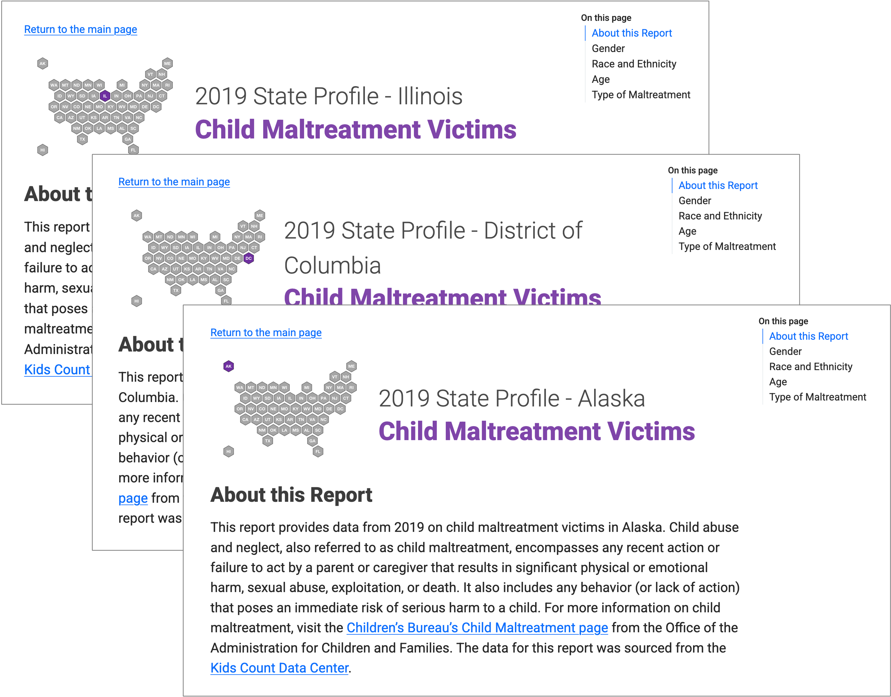

# 2019 State-Level Profiles - Child Maltreatment Victims

As state officials work to improve the health and well-being of children, data on child maltreatment victims can play a key role in supporting their efforts. This resource provides a comparison of state-level demographic data from 2019 on child maltreatment victims across various dimensions, including gender, race/ethnicity, age, and type of maltreatment. For more information on child maltreatment, visit the [Children's Bureau's Child Maltreatment page](https://www.acf.hhs.gov/cb/data-research/child-maltreatment) from the Office of the Administration for Children and Families. The data for this report was sourced from the [Kids Count Data Center](https://datacenter.kidscount.org/data). 

View the report on GitHub Pages: https://anyamemensah.github.io/child-mal.

Note: An [Excel version of the report](https://www.anyamemensah.com/child-maltreatment-data) is available on Ama Nyame-Mensah's website.

	

